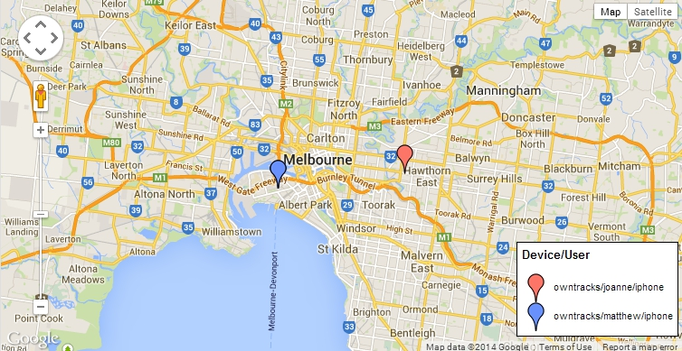

# gmaps

To be used with the [owntracks.org](http://owntracks.org/) project. Subscribes to a topic and plots the OwnTracks position in realtime using websockets.

## Requires

* A Websocket server (e.g. [WSS])
* An OwnTracks app
* A Google maps API key which you can obtain [here](https://code.google.com/apis/console)
* The PAHO [JavaScript client](http://git.eclipse.org/c/paho/org.eclipse.paho.mqtt.javascript.git/plain/src/mqttws31.js)

Created by [Matthew Bordignon] (https://twitter.com/bordignon).

  [wss]: https://github.com/stylpen/WSS/tree/mqtt
